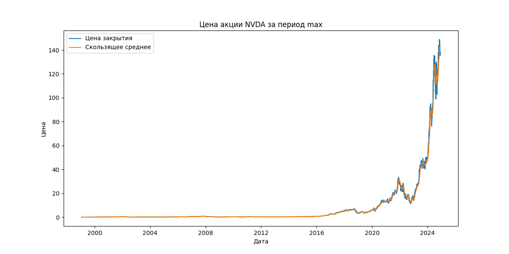

Общий обзор

Этот проект предназначен для загрузки исторических данных об акциях и их визуализации. Он использует библиотеку yfinance для получения данных и matplotlib для создания графиков. Пользователи могут выбирать различные тикеры и временные периоды для анализа, а также просматривать движение цен и скользящие средние на графике.

Структура и модули проекта

1. data_download.py:

- Отвечает за загрузку данных об акциях.

- Содержит функции для извлечения данных об акциях из интернета и расчёта скользящего среднего.

2. main.py:

- Является точкой входа в программу.

- Запрашивает у пользователя тикер акции и временной период, загружает данные, обрабатывает их и выводит результаты в виде графика.

3. data_plotting.py:

- Отвечает за визуализацию данных.

- Содержит функции для создания и сохранения графиков цен закрытия и скользящих средних.

Пошаговое использование

1. Запустите main.py.

2. Введите интересующий вас тикер акции (например, 'AAPL' для Apple Inc).

3. Введите желаемый временной период для анализа (например, '1mo' для данных за один месяц).

4. Программа обработает введённые данные, загрузит соответствующие данные об акциях, рассчитает скользящее среднее и отобразит график

Задания нацелены на улучшение пользовательского опыта и расширение аналитических возможностей проекта, предоставляя глубокие и настраиваемые инструменты для анализа данных об акциях.

Так же в программе имееться словарик с Тикитами основных акций можно воспользоваться для формирования отчетности

Пошаговая доработка приложения:
1. Реализовать функцию calculate_and_display_average_price(data), которая вычисляет и выводит среднюю цену закрытия акций за заданный период. 
Функция будет принимать DataFrame и вычислять среднее значение колонки 'Close'. Результат будет выводиться в консоль.

Примеры работы приложения 

